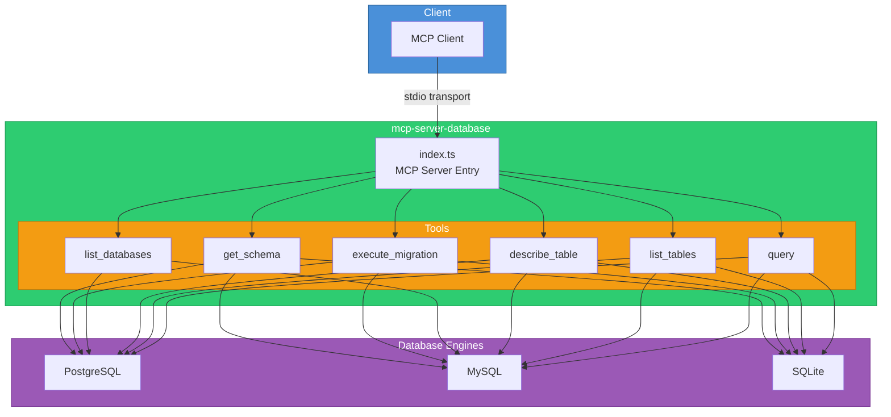

# mcp-server-database

An MCP (Model Context Protocol) server that provides tools for interacting with relational databases. Supports PostgreSQL, MySQL, and SQLite.

## Architecture



## Installation

```bash
npm install
npm run build
```

## Configuration

| Variable | Description | Required |
|---|---|---|
| `DB_DRIVER` | Database driver: `postgres`, `mysql`, or `sqlite` | Yes |
| `DB_HOST` | Database host | Yes (postgres/mysql) |
| `DB_PORT` | Database port | No |
| `DB_USER` | Database username | Yes (postgres/mysql) |
| `DB_PASSWORD` | Database password | Yes (postgres/mysql) |
| `DB_NAME` | Database name | Yes |
| `DB_PATH` | Path to SQLite file | Yes (sqlite) |

## Usage

### Standalone

```bash
DB_DRIVER=postgres DB_HOST=localhost DB_USER=admin DB_PASSWORD=secret DB_NAME=mydb npm start
```

### Development

```bash
npm run dev
```

### Docker

```bash
docker build -t mcp-server-database .
docker run -e DB_DRIVER=postgres -e DB_HOST=host.docker.internal -e DB_USER=admin -e DB_PASSWORD=secret -e DB_NAME=mydb mcp-server-database
```

### MCP Client Configuration

```json
{
  "mcpServers": {
    "database": {
      "command": "node",
      "args": ["dist/index.js"],
      "env": {
        "DB_DRIVER": "postgres",
        "DB_HOST": "localhost",
        "DB_PORT": "5432",
        "DB_USER": "admin",
        "DB_PASSWORD": "secret",
        "DB_NAME": "mydb"
      }
    }
  }
}
```

## Tool Reference

| Tool | Description | Parameters |
|---|---|---|
| `query` | Execute a SQL query | `sql`, `params?` |
| `list_tables` | List all tables | none |
| `describe_table` | Describe a table schema | `table_name` |
| `list_databases` | List databases on the server | none |
| `execute_migration` | Execute a migration SQL script | `sql` |
| `get_schema` | Get full database schema DDL | none |

## License

MIT
